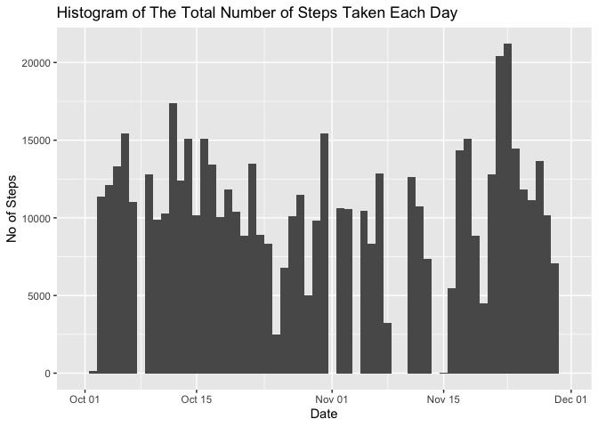
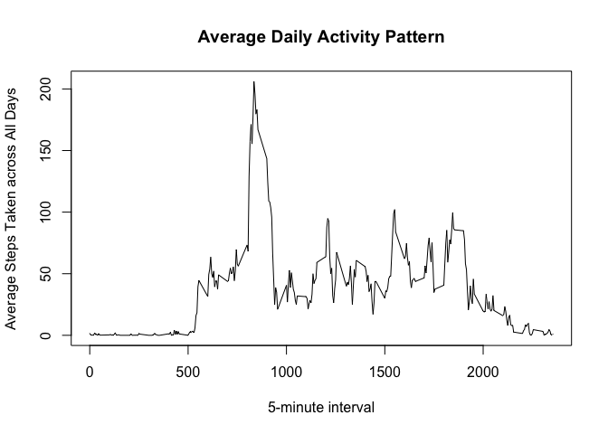
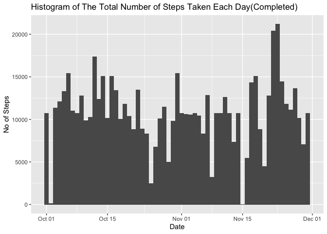
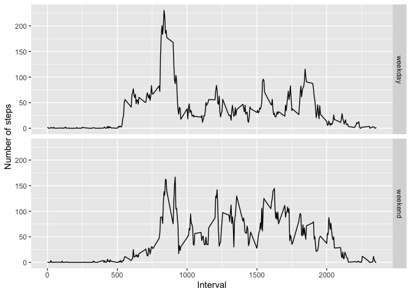

## Loading and Preprocessing The Data

The data is loaded and stored into variable `Data` using `read.csv()` function. Then the `date` column is converted  from `character` vector into `Date` vector.  

```r
Data <- read.csv("activity.csv")
Data$date <- as.Date(Data$date, format = "%Y-%m-%d")
```
  
  
##  Total Number of Steps Taken Per Day 

The total number of steps taken per day is calculated, ignoring missing value in dataset. Using  `tapply()` function, the total of steps is grouped by day and the sum is calculated.   

```r
byDay <- tapply(Data$steps, Data$date, sum, na.rm=TRUE)
print(byDay)
```

```
## 2012-10-01 2012-10-02 2012-10-03 2012-10-04 2012-10-05 2012-10-06 2012-10-07 
##          0        126      11352      12116      13294      15420      11015 
## 2012-10-08 2012-10-09 2012-10-10 2012-10-11 2012-10-12 2012-10-13 2012-10-14 
##          0      12811       9900      10304      17382      12426      15098 
## 2012-10-15 2012-10-16 2012-10-17 2012-10-18 2012-10-19 2012-10-20 2012-10-21 
##      10139      15084      13452      10056      11829      10395       8821 
## 2012-10-22 2012-10-23 2012-10-24 2012-10-25 2012-10-26 2012-10-27 2012-10-28 
##      13460       8918       8355       2492       6778      10119      11458 
## 2012-10-29 2012-10-30 2012-10-31 2012-11-01 2012-11-02 2012-11-03 2012-11-04 
##       5018       9819      15414          0      10600      10571          0 
## 2012-11-05 2012-11-06 2012-11-07 2012-11-08 2012-11-09 2012-11-10 2012-11-11 
##      10439       8334      12883       3219          0          0      12608 
## 2012-11-12 2012-11-13 2012-11-14 2012-11-15 2012-11-16 2012-11-17 2012-11-18 
##      10765       7336          0         41       5441      14339      15110 
## 2012-11-19 2012-11-20 2012-11-21 2012-11-22 2012-11-23 2012-11-24 2012-11-25 
##       8841       4472      12787      20427      21194      14478      11834 
## 2012-11-26 2012-11-27 2012-11-28 2012-11-29 2012-11-30 
##      11162      13646      10183       7047          0
```

The histogram of the total number of steps taken each day using is plotted using `ggplot`. Note the correpondence between value calculated above and the histogram plotted below.


```r
library(ggplot2)
ggplot(Data) + geom_histogram(aes(x=date, weight=steps), bins=length(unique(Data$date))) + 
    labs(x="Date", y="No of Steps", title = "Histogram of The Total Number of Steps Taken Each Day")
```

<!-- -->

Finally, the mean and median of total number of steps taken per day is calculated using functions as shown below: 


```r
mean <- mean(byDay)
median <- median(byDay)
```

Thus, we founded that the mean is 9354.2295082 and the medial is 10395.  


## Average Daily Activity Pattern

To calculate the average number of steps taken across all day for every 5 minutes interval, the data is grouped by interval and the mean of each interval is then calculated. `tapply()` function is used to achieved those 2 steps. 

The result is then plotted as a time series plot of the 5-minute interval (x-axis) and the average number of steps taken, averaged across all days (y-axis)


```r
byInterval <- tapply(Data$steps, Data$interval, mean, na.rm=TRUE)

plot(names(byInterval), byInterval, type='l', xlab="5-minute interval", ylab = "Average Steps Taken across All Days")
title(main="Average Daily Activity Pattern")
```

<!-- -->

From plot, it can be seen that the interval at around 850 contains the maximum number of stages. We confirm this by running the code 

```r
maxInterval <- names(byInterval)[which(byInterval == max(byInterval))]
```

The result is 835, having value of 206.1698113


## Imputing Missing Value

### Calulate the total number of missing values in the dataset

Using the code below, we calculate the number of missing value


```r
noNA <- sum(is.na(Data$steps))
```

Thus, the total number of missing values in the dataset is 2304.

### Filling in the missing values

The missing value is filled in using the average of the mean of the day and the mean of the 5-minutes interval. The value is given by the function below

```r
fillNa <- function(date, interval) {
    dayMean <- byDay[date] / sum(Data$date == date)
    intervalMean <- byInterval[as.character(interval)]
    if (dayMean != 0) {
        print("this")
        return((dayMean + intervalMean) / 2)
    } else {
        return(intervalMean)
    }
}
```

### Creating a new dataset without missing value

We first compute the `steps` for the new dataset. Then we create the new data steps using the computed `steps` and the subset od the old dataset.


```r
steps <- numeric()
for (i in 1:nrow(Data)) {
    if (is.na(Data$steps[i])) {
        steps <- c(steps, fillNa(as.character(Data$date[i]), Data$interval[i]))
    } else {
        steps <- c(steps, Data$steps[i])
    }
}
newData <- cbind(steps, Data[,2:3])
```

### Redrawn the histogram of the total number of steps taken each day with new dataset

```r
library(ggplot2)
ggplot(newData) + geom_histogram(aes(x=date, weight=steps), bins=length(unique(newData$date))) + 
    labs(x="Date", y="No of Steps", title = "Histogram of The Total Number of Steps Taken Each Day(Completed)")
```

<!-- -->

Finally, the new mean and median of total number of steps taken per day is calculated using functions as shown below: 


```r
byDayNew <- tapply(newData$steps, newData$date, sum, na.rm=TRUE)
meanNew <- mean(byDayNew)
medianNew <- median(byDayNew)
```

Thus, we founded that the new mean is 1.0766189\times 10^{4} and the new median is 1.0766189\times 10^{4}.  Note that both mean and median have increased as a result of imputing the data.

## Differencrs in Activity Patterns Between Weekdays and Weekends

A new factor variable is first added into the dataset with two levels – “weekday” and “weekend” indicating whether a given date is a weekday or weekend day.


```r
newData$day <- sapply(newData$date, function(x){
    if (weekdays(x) %in% c("Saturday", "Sunday")) {
        return("weekend")
    } else {
        return("weekday")
    }
})
newData$day <- as.factor(newData$day)
```

A panel plot containing a time series plot of the 5-minute interval (x-axis) and the average number of steps taken, averaged across all weekday days or weekend days (y-axis) is then created.

```r
library(dplyr)
```

```
## 
## Attaching package: 'dplyr'
```

```
## The following objects are masked from 'package:stats':
## 
##     filter, lag
```

```
## The following objects are masked from 'package:base':
## 
##     intersect, setdiff, setequal, union
```

```r
library(ggplot2)
summary <- newData %>% group_by(day, interval) %>% summarize(avg=mean(steps))
```

```
## `summarise()` regrouping output by 'day' (override with `.groups` argument)
```

```r
ggplot(summary) + geom_line(aes(interval,avg)) + facet_grid(day~.) + labs(x="Interval") + 
    labs(y="Number of steps")
```

<!-- -->
